# «Домовой»

Продукт команды **antihype** для трека «Умный город»: заявки в управляющую компанию,
показания, квитанция, домофон, собрания и информирование жильцов в чат-боте и мини-приложении
MAX. В том же репозитории лежит **MaxKit**: инструментарий для разработки под платформу MAX,
на котором продукт собран.

## Содержание

- [Проверка продукта](#проверка-продукта)
  - [За несколько минут](#за-несколько-минут)
  - [Учётные записи](#учётные-записи)
  - [Коды квартир для привязки](#коды-квартир-для-привязки)
  - [Переключение ролей](#переключение-ролей)
  - [Проверка API](#проверка-api)
  - [Без токена и без сети](#без-токена-и-без-сети)
  - [Документы и данные](#документы-и-данные)
- [Пошаговый сценарий проверки](#пошаговый-сценарий-проверки)
- [Функционал продукта](#функционал-продукта)
- [Языки](#языки)
- [Как это выглядит](#как-это-выглядит)
- [Состояния заявки](#состояния-заявки)
- [Запуск](#запуск)
  - [Одной командой](#одной-командой)
  - [Один адрес на всё](#один-адрес-на-всё)
  - [Переменные окружения](#переменные-окружения)
  - [Сертификат платформы](#сертификат-платформы)
  - [Апдейты: опрос в разработке, вебхук в бою](#апдейты-опрос-в-разработке-вебхук-в-бою)
  - [Модель для разбора текста, голоса и фото](#модель-для-разбора-текста-голоса-и-фото)
  - [Запуск без Docker](#запуск-без-docker)
  - [Порты](#порты)
  - [Остановка и повторный запуск](#остановка-и-повторный-запуск)
- [Боевая установка](#боевая-установка)
- [Соответствие требованиям кейса](#соответствие-требованиям-кейса)
  - [Комплектность сдачи](#комплектность-сдачи)
  - [Назначение решения](#назначение-решения)
  - [Состав и архитектура решения](#состав-и-архитектура-решения)
  - [Зависимости](#зависимости)
  - [Внешние сервисы и интеграции](#внешние-сервисы-и-интеграции)
  - [Работа с данными](#работа-с-данными)
  - [Безопасность и персональные данные](#безопасность-и-персональные-данные)
  - [Примеры ожидаемого поведения](#примеры-ожидаемого-поведения)
  - [Мобильный клиент и веб-клиент](#мобильный-клиент-и-веб-клиент)
  - [Известные ограничения](#известные-ограничения)
- [Разработка](#разработка)
  - [Быстрый старт](#быстрый-старт)
  - [Стенд с мини-приложением](#стенд-с-мини-приложением)
  - [Лендинг](#лендинг)
  - [MaxKit](#maxkit)
  - [Пакеты](#пакеты)
  - [Документация](#документация)
- [Лицензия](#лицензия)

## Проверка продукта

| Что | Где |
| --- | --- |
| Чат-бот в MAX | [`https://max.ru/t478_hakaton_max_bot`](https://max.ru/t478_hakaton_max_bot), ник `t478_hakaton_max_bot` |
| Мини-приложение | открывается из чата с ботом кнопкой «Открыть приложение»; адрес внутри клиента MAX `https://domovoy.homes/app/` |
| Сайт продукта | [`https://domovoy.homes`](https://domovoy.homes) |
| API | `https://domovoy.homes/api/…`, описание [`openapi.json`](openapi.json) и `GET https://domovoy.homes/openapi.json` |
| Состояние | `GET https://domovoy.homes/health` отвечает `{"status":"ok","storage":"ok"}` |
| Весь функционал списком | [`docs/features.md`](docs/features.md) |
| Правила, роли и ограничения | [`docs/product.md`](docs/product.md) |
| Сценарий с ожидаемыми ответами | [«Пошаговый сценарий проверки»](#пошаговый-сценарий-проверки) |

Установка поднята с переключением ролей (`DEMO_ROLES=1`) и заглушками домофонии, оплаты,
канала передачи обращений, системы собраний и капитального ремонта (`HUB=mock`,
`PAYMENTS=mock`, `HANDOFF=mock`, `MEETINGS=mock`, `CAPITAL_REPAIR=mock`, `CITY_FEED=mock`). Разбор текста,
расшифровка голосовых и чтение табло счётчика идут в GigaChat. Данные заведены командой
`seed`: дом Д15 по адресу ул. Ленина, 15 и дом Д17 той же управляющей организации, жильцы,
смена, заявки в разных состояниях, показания, квитанции, собрание и объявления.

Каждый день в 04:00 по Москве набор для показа заводится заново (`DEMO_RESEED_HOUR=4`):
заявки, привязки и роли, сделанные при проверке, стираются, коды квартир и учётные записи
ниже снова совпадают с описанием. Проверку, начатую вечером, утром продолжают с привязки.

### За несколько минут

1. Открыть бота, отправить `/start`, выбрать язык кнопкой (первым стоит язык клиента MAX),
   принять документы: бот попросит код квартиры. Язык меняется в любой момент командой `/lang`.
2. Отправить сообщением код `PRTM4837`: бот привяжет квартиру 5 дома Д15 и откроет разделы.
3. Написать «Разбито стекло в окне на площадке третьего этажа»: придут номер заявки,
   категория и срок.
4. Нажать «Открыть приложение»: заявка стоит в списке с тем же номером.
5. Отправить `/demo` (или нажать «👥 Роль» в меню), выбрать «Диспетчер»: в разделе «Очередь»
   открыть заявку, нажать «Принять», выбрать исполнителя и «В работу».
6. Переключиться на «Мастер»: в разделе «Работа» открыть наряд, приложить снимок, написать,
   что сделано, и нажать «Сдать».
7. Вернуться в роль «Жилец» и принять работу: заявка закрыта, в истории все переходы.
8. Проверить API по `DATA-API.yaml` (нужен токен бота от организаторов):

   ```bash
   npm install && npm run build
   BOT_TOKEN=<токен> API_URL=https://domovoy.homes npm run check-api
   ```

   Ожидаемый итог: `проверок 30, замечаний 0`.

Бот отвечает и на слова без кнопок: «холодная вода 12350», «когда дадут горячую воду»,
«починил», «отзываю заявку», а также на фотографию табло счётчика.

Голосом продукт пользуются в мини-приложении: кнопка микрофона у помощника, в новой заявке
и в сообщениях. Записанное в чате голосовое до бота не доходит: платформа присылает такой
апдейт без тела сообщения, без отправителя и без вложения, поэтому ответить на него нечем.
Разбор с сырым апдейтом: [`docs/max-platform.md`](docs/max-platform.md#голосовое-сообщение-боту-платформа-не-доставляет).

### Учётные записи

Пароля нет: вход идёт через MAX, роль определяется идентификатором MAX. Учётные записи
ниже заведены набором для показа и нужны автоматическим проверкам из
[`DATA-API.yaml`](DATA-API.yaml). На стенде разработки под ними открывается мини-приложение,
в MAX проверяющий входит своей учётной записью и примеряет роли
([«Переключение ролей»](#переключение-ролей)).

| MAX id | Кто | Роль | Квартиры |
| --- | --- | --- | --- |
| 1001 | Мария | жилец | кв. 1 дома Д15, кв. 4 дома Д17 |
| 1002 | Иван | жилец | кв. 2 дома Д15 |
| 1003 | Анна | жилец | кв. 3 дома Д15 |
| 1004 | Пётр | жилец | кв. 6 дома Д15 |
| 2001 | Ольга Титова | диспетчер | кв. 8 дома Д17 |
| 2002 | Сергей Малых | мастер | |
| 2003 | Нина Гордеева | управляющий | |
| 2004 | Лифтсервис | подрядчик | только порученные наряды |

### Коды квартир для привязки

Квартира привязывается кодом из квитанции: сообщением боту из одного кода, пунктом
«🏢 Квартира» в меню бота, разделом «Квартира» в приложении или ссылкой
`https://max.ru/t478_hakaton_max_bot?start=<код>`. До привязки продукт жильцу ничего не
отвечает, кроме просьбы прислать код: дом человека ещё неизвестен, а заявка без адреса
не заводится. После привязки открывается всё: заявки, счётчики, квитанция, домофон,
собрания, приём и поддержка. У сотрудника дом берётся из назначения роли, код ему не нужен.

Свободные квартиры, по одной на проверяющего:

| Дом | Квартира | Код | Подъезд, стояк |
| --- | --- | --- | --- |
| Д15 | 5 | `PRTM4837` | подъезд 1, стояк 1 |
| Д15 | 7 | `CHWK7394` | подъезд 1, стояк 1 |
| Д15 | 8 | `FNLA8473` | подъезд 1, стояк 1 |
| Д15 | 9 | `MVXE3948` | подъезд 1, стояк 1 |
| Д15 | 10 | `YMCF4798` | подъезд 1, стояк 2 |
| Д15 | 20 | `XPTK3947` | подъезд 2, стояк 1 |
| Д15 | 21 | `UYPC4739` | подъезд 2, стояк 1 |
| Д15 | 22 | `RKAH9384` | подъезд 2, стояк 2 |

Квартиры с жильцами из набора: кв. 1 `KVMR4783` (Мария, стояк 1), кв. 2 `HTPN9434` (Иван),
кв. 3 `LWEC7439` (Анна), кв. 6 `NRUA8374` (Пётр) в доме Д15; кв. 4 `VNAL7893` (Мария)
и кв. 8 `CWHE4837` (Ольга Титова) в доме Д17. Один код принимают несколько учётных записей,
соседям по квартире уходит сообщение о новом жильце. Пять промахов подряд закрывают привязку
на час.

Что где проверять:

- кв. 2, 3, 6 и 10 стоят на стояке 2 первого подъезда, там идёт авария по горячей воде:
  привязка к кв. 10 показывает опрос соседей, склейку обращений и границу аварии на плане дома;
- кв. 5, 7, 8 и 9 на стояке 1 того же подъезда: заявка по квартире заводится отдельно,
  общедомовая по подъезду присоединяется к открытой, если она уже есть;
- кв. 20, 21 и 22 во втором подъезде: аварии первого подъезда их не касаются, объявления
  по подъездам приходят раздельно.

### Переключение ролей

Проверяющий входит своей учётной записью MAX, а сценарий проходят пять сторон, поэтому роль
примеряется прямо в продукте. В боте это команда `/demo` и кнопка «👥 Роль» в первом ряду
меню, в приложении раздел «Роль» в группе «Проверка» списка «Ещё». Выбор меняет роль самой
учётной записи: разделы, права и уведомления те же, что у настоящего жильца, диспетчера,
мастера, управляющего или подрядчика. Сотруднику и подрядчику назначается дом Д15 и дежурство,
чтобы уведомления смены приходили ему и вне рабочего времени; жильцу без привязанной квартиры
выдаётся свободная квартира дома, привязка к другой проверяется кодом из таблицы. Обратное
переключение делается тем же способом.

Роли учётных записей 1001-2004 не переключаются: на них опираются проверки из `DATA-API.yaml`.
Без `DEMO_ROLES` команды и раздела нет, `GET /api/demo` и `POST /api/demo` отвечают 403,
роль выдаёт управляющий в разделе «Люди дома».

### Проверка API

Токен сессии для роли выдаётся тем же путём, что и мини-приложению: параметры запуска
подписываются токеном бота и обмениваются на сессию через `POST /auth/session`.

```bash
npm install && npm run build
BOT_TOKEN=<токен> API_URL=https://domovoy.homes node scripts/token.mjs 1001 Мария
curl -H "Authorization: Bearer <токен_сессии>" https://domovoy.homes/api/me
```

`npm run check-api` прогоняет 30 обязательных проверок из [`DATA-API.yaml`](DATA-API.yaml):
для каждой берёт сессию нужной роли из таблицы выше, сверяет код ответа, тип содержимого
и обязательные поля. Проверки идут цепочкой по одной заявке: заводят её, ведут через
диспетчера, мастера и приёмку жильцом. Прогон повторяемый, на одной установке проходит
подряд. Вход ограничен десятью попытками в минуту с одного адреса: при `429` скрипт называет,
через сколько секунд повторить.

Описание маршрутов: [`openapi.json`](openapi.json), он же отдаётся на `GET /openapi.json`.
Маршруты словами: [`apps/api/README.md`](apps/api/README.md).

### Без токена и без сети

```bash
npm install && npm run build
npm run walkthrough --workspace @domovoy/server
```

Прогон поднимает локальный эмулятор Bot API, запускает настоящий бот и печатает разговор:
объявленные плановые работы, обращение вопреки им, сосед по стояку нажимает «У меня тоже»,
диспетчер назначает мастера и переписывается с жильцом, мастер сдаёт работу, жилец
возвращает её, диспетчер закрывает заявку за жильца после звонка, домофон и гостевой код,
заявка от датчика дыма, показания, квитанция и оплата, долги дома, собрание собственников,
запись на приём, вопрос в поддержку, наклейка объекта, рассылка, дежурство и обращение
из общего чата дома.

### Документы и данные

- Политика обработки персональных данных: [`https://domovoy.homes/privacy/`](https://domovoy.homes/privacy/).
- Пользовательское соглашение: [`https://domovoy.homes/terms/`](https://domovoy.homes/terms/).
  В боте оба документа отдаёт команда `/legal`, в приложении они открываются своим экраном.
- Тестовые данные файлами: [`testdata/`](testdata): `demo.json` описывает людей, дома,
  помещения, приборы, заявки, объявления, собрания и обращения; `apartments.csv`
  и `equipment.csv` заводятся импортом продукта. Тот же набор заводит `seed`, файлы
  собираются командой `npm run testdata` и проверяются тестами.
- Все данные вымышленные: настоящих адресов, жильцов и лицевых счетов в наборе нет.
- Содержание презентации: [`docs/pitch.md`](docs/pitch.md).

## Пошаговый сценарий проверки

Жилец пишет боту или открывает мини-приложение, описывает поломку одним сообщением
(текст или фотография, в приложении ещё и голосом) или сканирует наклейку на подъезде. Продукт определяет
категорию и срочность, называет номер заявки и нормативный срок. Диспетчер видит заявку
в очереди дома, принимает её и назначает мастера. Мастер отчитывается фотографией и сканом
наклейки на объекте. Жилец принимает работу или возвращает её с объяснением. Обо всех
переходах обе стороны узнают уведомлением в MAX.

| Шаг | Кто и где | Действие | Что человек получает |
| --- | --- | --- | --- |
| 1 | Жилец, чат с ботом | отправляет код квартиры, затем пишет «Разбито стекло в окне на площадке третьего этажа» или шлёт фото, скан наклейки | подтверждение привязки; номер заявки, категорию и срок |
| 2 | Жилец, раздел «Заявки» | видит заявку в списке | состояние и остаток времени до срока |
| 3 | Диспетчер, раздел «Очередь» | «Принять», затем выбор исполнителя и «В работу» | заявка уходит мастеру, жильцу приходит уведомление |
| 4 | Мастер, раздел «Работа» | открывает наряд, прикладывает снимок работы | снимок попадает в историю заявки |
| 5 | Мастер, карточка заявки | «Сканировать код» на объекте или «Закрыть без скана», коротко пишет, что сделано, «Сдать» | скан ставит отметку «был на месте», отметку о работе видит жилец вместе с уведомлением о приёмке |
| 6 | Жилец, карточка заявки | ставит оценку и «Принять работу» либо возвращает с причиной | заявка закрывается или возвращается мастеру |
| 7 | Диспетчер, заявка по воде из очереди | «Передать» ресурсникам дома | жильцу приходит срок ответа с пунктом правил, ответ записывается кнопкой «Ответ получен» |
| 8 | Управляющий, раздел «Сводка» | смотрит работу за период | доля в срок, среднее время, разрезы по категориям и исполнителям |

Шаги 1, 3, 5 и 6 проходятся и одним ботом, без мини-приложения: там же кнопки приёма,
сдачи и приёмки. Следующее действие стоит кнопкой под сообщением или на самом экране.
Роль между шагами меняется командой `/demo` или разделом «Роль».

Дальше по тому же дому: показания («холодная вода 12350» боту или раздел «Счётчики»),
квитанция и оплата (раздел «Оплата», в переписке `/bill`), домофон и гостевой код
(`/door`), собрание с голосом по доле площади (раздел «Собрания»), запись на приём
(раздел «Приём»), вопрос в поддержку (`/support`), сводка, долги и узел учёта у смены.
Полный перечень с местом каждого действия: [`docs/features.md`](docs/features.md).

Без токена и без сети тот же путь проигрывается командой
`npm run walkthrough --workspace @domovoy/server`. Сценарий повторяемый: `npm run check-api`
проходит подряд на одной и той же установке, а прогон без сети играется столько раз, сколько
нужно. После отказа продукт продолжает работать без перезапуска: в приложении остаётся
кнопка повтора, в переписке бот называет причину и предлагает следующий шаг. Интерфейс
сообщает о загрузке скелетоном, об итоге действия всплывающим уведомлением, об отказе
строкой с причиной и повтором.

## Функционал продукта

«Домовой» ведёт обращение жильца многоквартирного дома от первого сообщения до принятой
работы внутри MAX. Жилец сообщает о поломке словами, фотографией или сканом наклейки
на объекте, а в мини-приложении ещё и голосом; продукт определяет категорию, считает
нормативный срок, показывает статус и уведомляет о каждом переходе. Управляющая организация получает очередь дома, назначение
исполнителя, контроль сроков и отчётность. Рядом с заявками: показания и квитанция
по ПП 354 с общедомовыми нуждами и пенями, домофон и гостевые коды, собрание собственников
по долям площади, запись на приём, поддержка, объявления и рассылки, осмотры общего
имущества, наклейки с кодами объектов, сводка по дому и выгрузки для ГИС ЖКХ.

Перечень всего функционала по ролям и слоям, с местом каждого действия и файлом кода:
[`docs/features.md`](docs/features.md). Правила продукта, роли, что в чате и что
в приложении: [`docs/product.md`](docs/product.md). Какое правило из какой нормы:
[`docs/regulations.md`](docs/regulations.md).

Бот и мини-приложение вызывают одни и те же сценарии прикладного слоя, поэтому правила
везде одни. Сами интерфейсы разведены по делу: в чате короткое, в приложении списки,
формы и сравнение. Ботом пользуются и без кнопок, обычными словами, в любой момент.
Голос работает в мини-приложении: платформа не доставляет боту голосовые сообщения.

## Языки

Жилец говорит с продуктом на своём языке. Первый вопрос в боте и первый экран в
мини-приложении, ещё до документов и до привязки квартиры, это выбор языка:
русский, английский, татарский, узбекский, таджикский, киргизский, казахский,
азербайджанский, армянский, туркменский, грузинский, румынский (молдавский),
китайский. Язык клиента MAX из апдейта стоит в списке первым. Меняется он
командой `/lang`, пунктом меню «🌐 Язык» и разделом «Язык» в мини-приложении.

Язык принадлежит жильцу. Смену, подрядчика и управляющего о языке не спрашивают:
очередь, наряды, сводка и журнал ведутся по-русски на всю организацию.

Даты, время и числа тоже идут на языке человека: месяц словом из словаря,
«вчера» и «завтра», свой разделитель дробной части и своя форма слова по числу.
У смены они остаются русскими, рубль остаётся рублём.

Все надписи продукта лежат в словарях `packages/i18n/src/locales/<код>`,
по файлу на область: `app`, `bot`, `miniapp`. Русский словарь исходный, на него
падает строка без перевода. Подстановки в строках именованные: `{номер}`,
`{сумма}`, `{срок}`. Проверки сверяют, что у всех языков один набор ключей и
одни и те же подстановки.

Пользовательское соглашение и политика обработки персональных данных переведены
на все языки и лежат в `packages/i18n/src/legal`. Бот даёт ссылку сразу на
версию на языке человека, `GET /api/legal` отдаёт документы на его языке, на
сайте они открываются по адресам `/<код>/privacy/` и `/<код>/terms/` и
переключаются кнопкой языка. Дата редакции по-русски словами, на остальных
языках цифрами.

Написанное жильцом не по-русски переводится для смены. Обращение, реплика в
переписке и вопрос в поддержку уходят диспетчеру по-русски, под переводом
идёт исходный текст с названием языка. По русскому тексту считаются категория,
срок и поиск. Ответ смены переводится обратно на язык жильца. Переводит та же
модель, что разбирает текст, адрес задаётся `REASONER_URL`. Без модели текст
доходит как есть, сценарий не прерывается.

Помощник отвечает на языке вопроса и, если этот язык у продукта есть, предлагает
кнопкой перейти на него, не теряя самого ответа. Голосовое сообщение
расшифровывается с учётом выбранного языка.

Экраны смены остаются русскими: очередь, наряды, сводка, дежурство, рассылка,
наклейки, журнал, тарифы, карточка дома. Общий чат дома тоже русский, сообщение
там одно на всех соседей.

Новый язык добавляется файлом словаря, строкой в `packages/i18n/src/languages.ts`
и, если документы переведены, файлом в `packages/i18n/src/legal`. Страницы сайта
и списки выбора языка собираются из этих перечней сами.

## Как это выглядит

Снимки сделаны с работающего продукта на демонстрационных данных: мини-приложение
внутри эмулятора клиента MAX, оформление на официальном ките платформы.

| Жилец | Диспетчер | Управляющая компания |
|---|---|---|
| 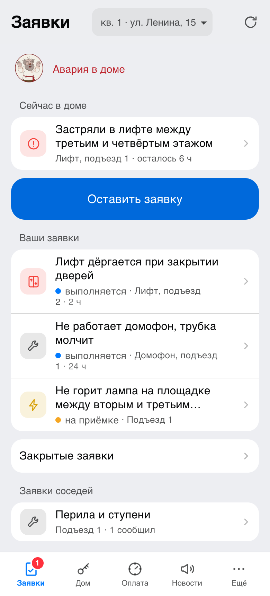 | 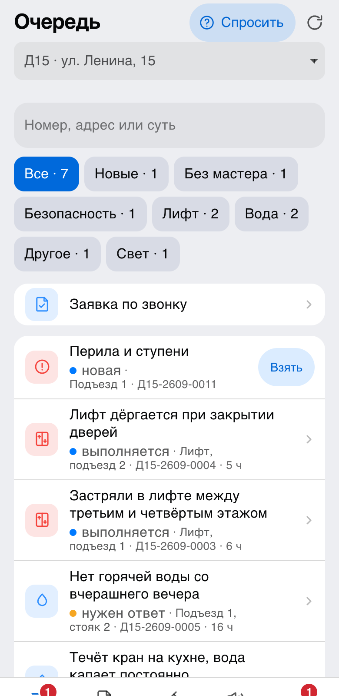 | 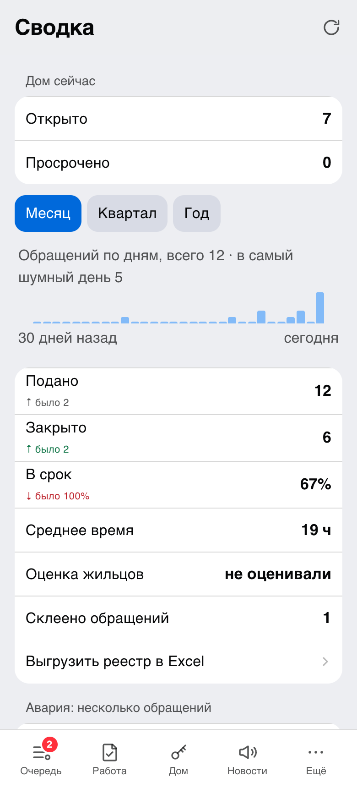 |
| Что в доме сейчас, ниже свои заявки: суть, адрес и срок в строке | Поиск, отбор по категории, номер для разговора по телефону | Работа за период рядом с прошлым и разрезы по категориям и исполнителям |

| Заявка | Опрос соседей | План дома |
|---|---|---|
| 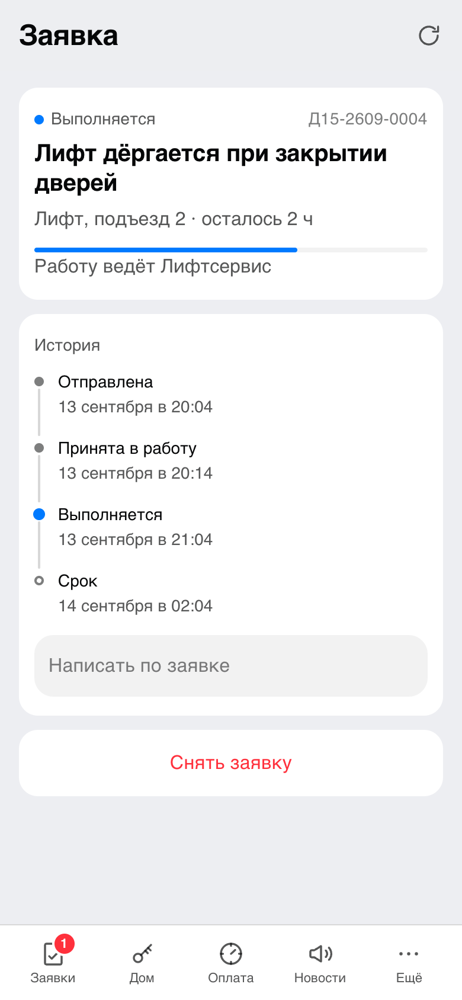 | 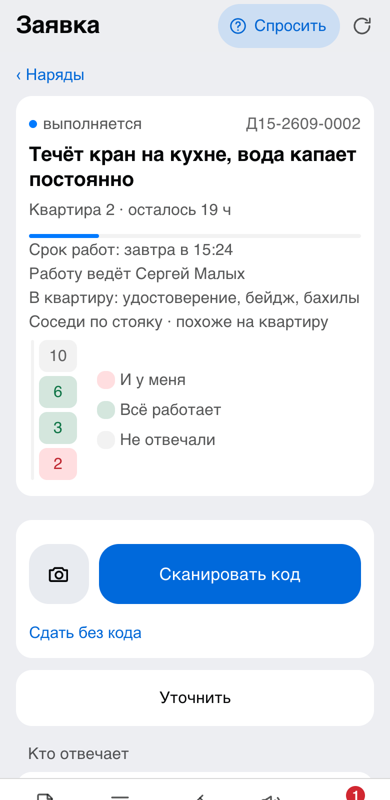 | 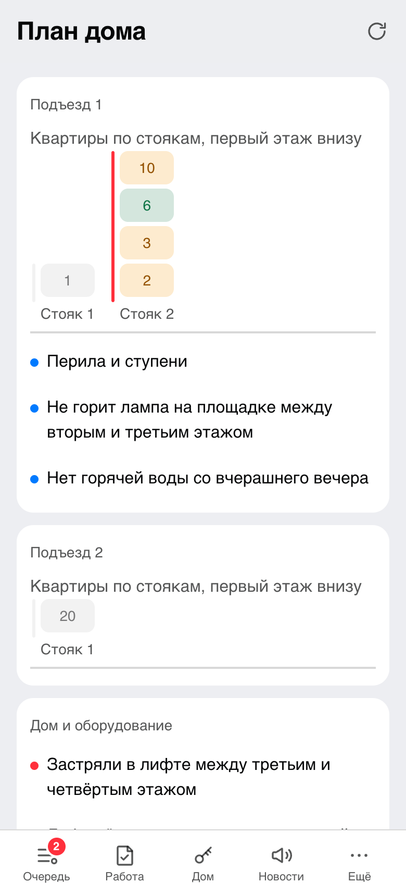 |
| Ход работы лентой, переписка с управляющей компанией, полоса прошедшего срока | Карта стояка: кто ответил «то же самое», у кого всё работает, кто промолчал | Те же ответы на схеме дома: подъезды, стояки и квартиры в них |

| Собрание | Квитанция | Здоровье дома |
|---|---|---|
| 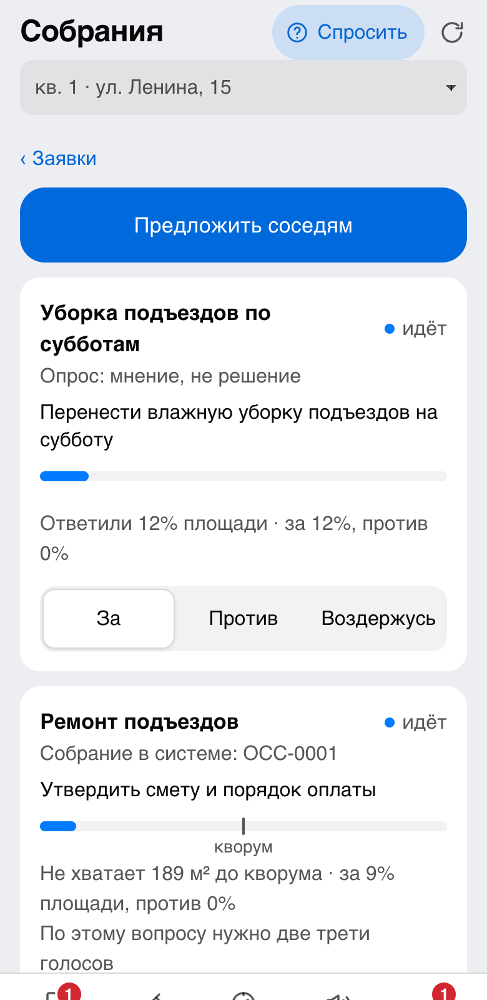 | 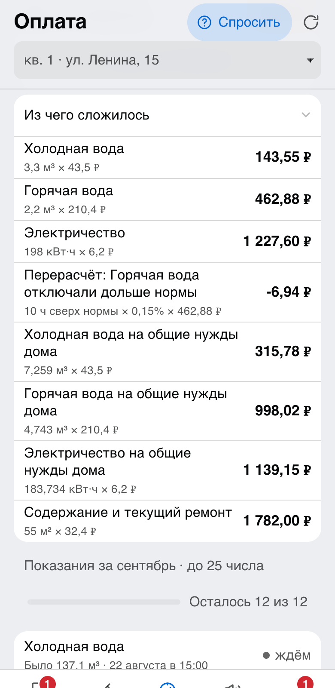 | 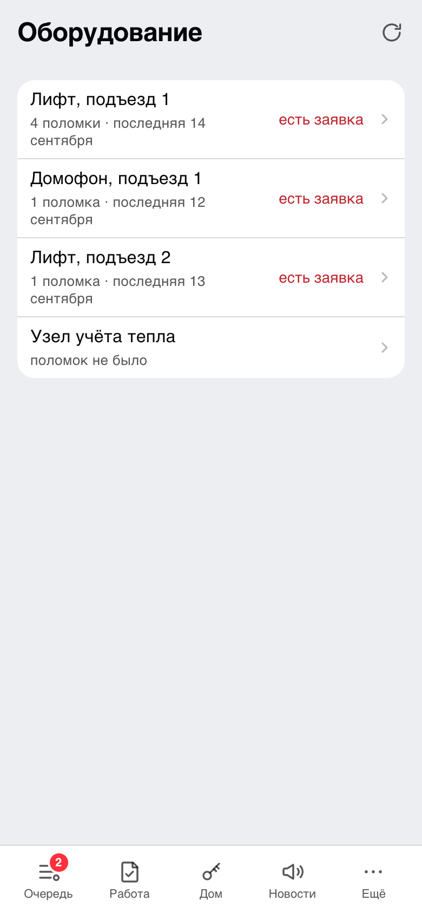 |
| Голос учитывается долей в общей площади, полоса показывает набор кворума | Сумма по строкам, включая общедомовые нужды и пени; каждая строка называет способ расчёта | Промежутки между отказами по истории дома |

| Код с наклейки | Осмотры общего имущества | Запись на приём |
|---|---|---|
| 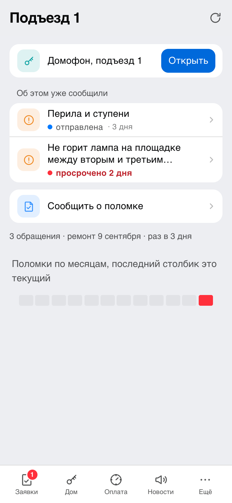 | 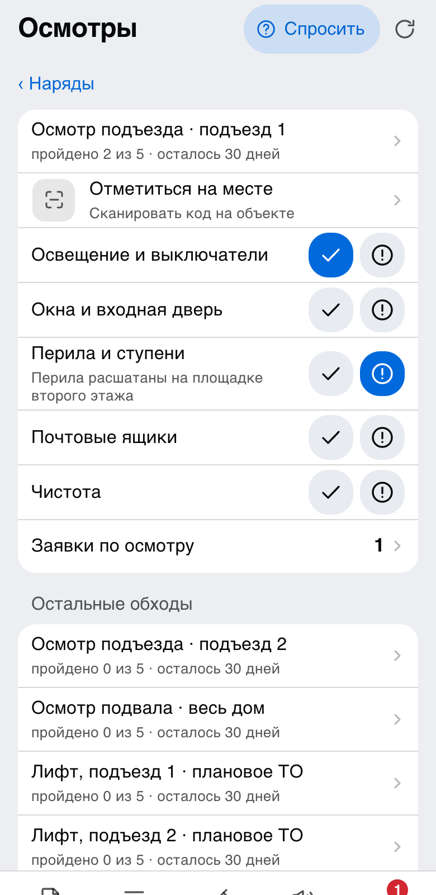 | 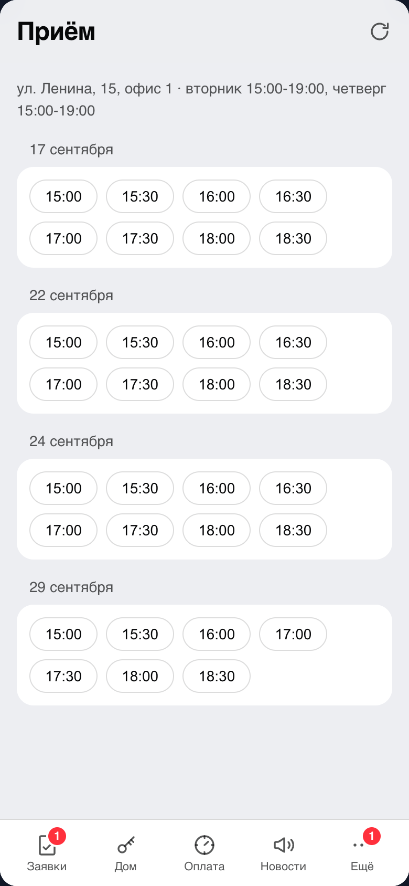 |
| Наклейка ведёт к объекту: открыть дверь, посмотреть камеру, выдать код гостю, сообщить о поломке | Обход по чек-листу минимального перечня, найденный недостаток становится заявкой | Свободные часы приёма по дням, занятое время пропадает из списка |

| Долги дома | Общедомовой узел учёта | Люди дома |
|---|---|---|
| 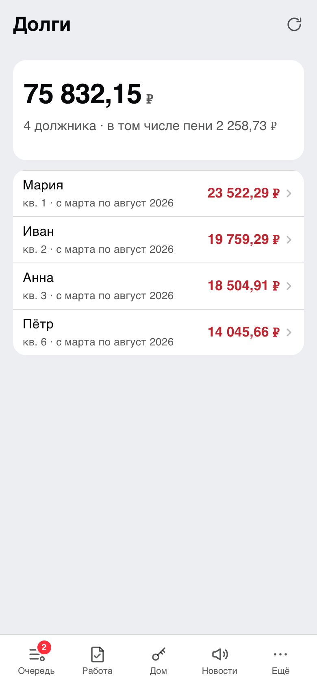 | 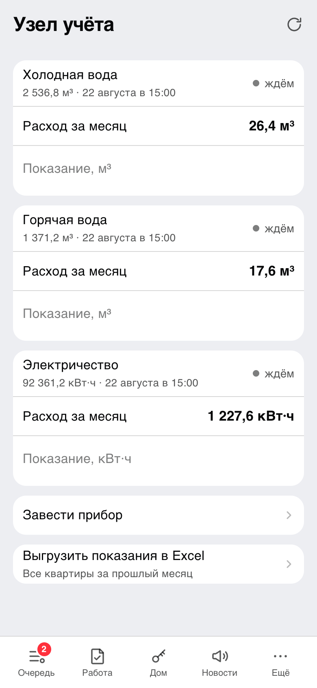 | 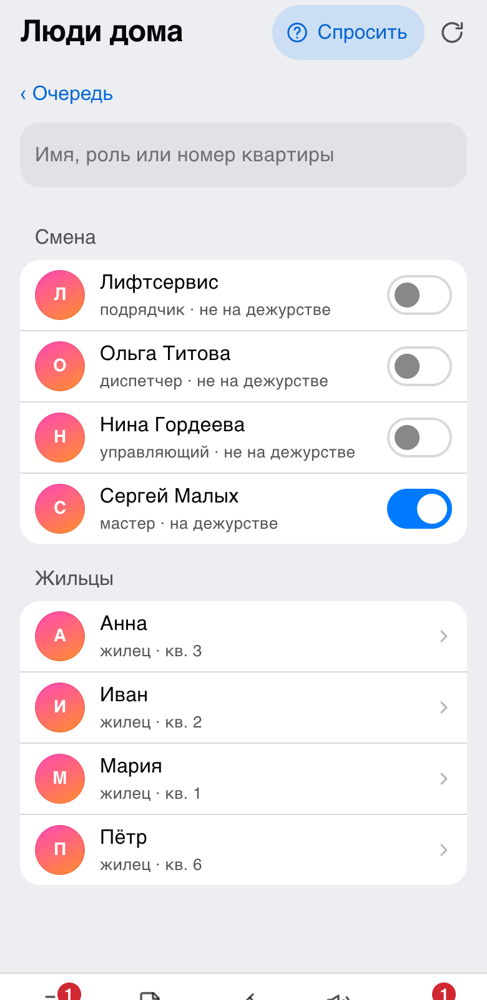 |
| Крупные должники сверху, пени и месяцы просрочки, напоминание одному должнику | Расход дома за месяц, разница с суммой квартирных счётчиков делится по площади в строку ОДН | Смена и жильцы с квартирами, роли и дежурство раздаёт управляющий |

| Выбор языка | Новая заявка | Помощник |
|---|---|---|
| 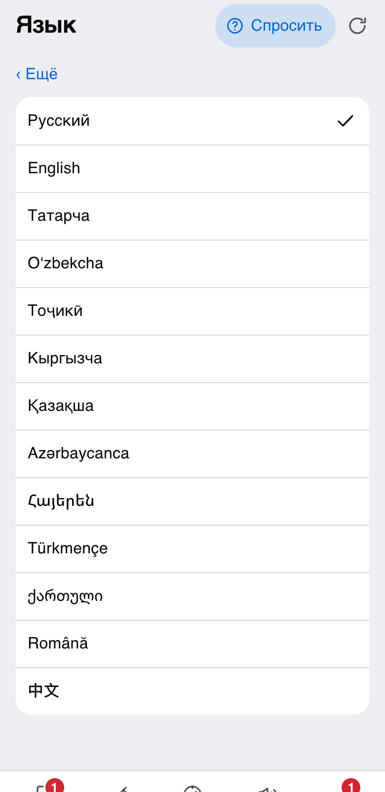 | 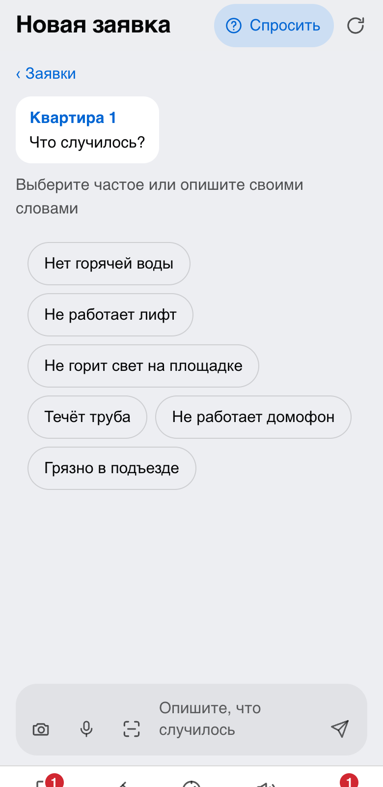 | 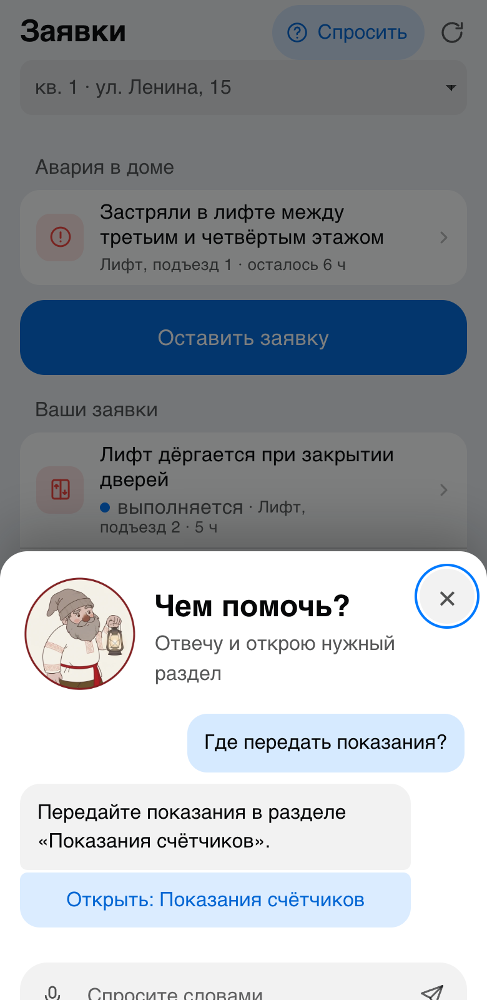 |
| Тринадцать языков, каждый назван на себе самом; о языке спрашивают до документов и до привязки квартиры | Частые поломки готовыми кнопками, фотография и запись голосом рядом с полем | Короткий ответ по данным дома и готовый переход в нужный раздел |

## Состояния заявки

```
new ──► accepted ──► in_progress ──► done ──► confirmed
 │         │              │           │
 │         └──► needs_info ◄┘         └──► in_progress  (работа не принята)
 ├──► rejected ◄────────────┘
 └──► withdrawn                       (жилец снял своё обращение)
```

Кто вправе сделать переход, задано данными: принимает и отклоняет диспетчер, берёт в работу
и сдаёт мастер, работу принимает жилец. Диспетчер и управляющий тоже закрывают заявку
за жильца и возвращают работу в работу, но только с объяснением: жилец не всегда говорит
о приёмке кнопкой, а переделать работу просит и мастер по телефону. Отказ без причины,
уточнение без вопроса, возврат работы без объяснения и сдача работы без отметки о сделанном
не принимаются. В работу заявка уходит с исполнителем: мастер и подрядчик записывают наряд
на себя, диспетчер и управляющий называют человека. Завершённых состояний
три, и из них переходов нет.

## Запуск

### Одной командой

```bash
BOT_TOKEN=<токен> docker compose up
```

Поднимаются Postgres, Redis, продукт и Caddy перед ним. Сайт открывается на
`http://localhost:8080`, миграции применяются при старте, позиция в потоке апдейтов лежит
на томе. Для проверки ролями та же команда с `DEMO_ROLES=1`, данные для показа заводятся
командой `docker compose exec domovoy node apps/domovoy/dist/cli.js seed`.

Зависимости ставятся один раз, в рабочий образ идут только собранный код, описания пакетов
и миграции. Отрисовка наклеек в растр идёт готовой сборкой `@resvg/resvg-js` под платформу
и шрифтом из зависимостей: системные шрифты в образе не нужны. Если сборки под платформу
нет, продукт скажет об этом в журнале и продолжит работать, наклейка уйдёт разметкой.

### Один адрес на всё

Лендинг, мини-приложение и API отдаёт один сервер:

```
domovoy.homes/            лендинг с кнопкой «Открыть в MAX»
domovoy.homes/privacy/    политика обработки персональных данных
domovoy.homes/terms/      пользовательское соглашение
domovoy.homes/app/        мини-приложение
domovoy.homes/api/…       API, вход в сессию и события домофонии
domovoy.homes/bot/updates апдейты платформы по вебхуку
```

Мини-приложению на одном адресе не нужен CORS, сертификат нужен один, версии статики и API
не расходятся. Приложение обращается к API относительным путём, поэтому сборка не знает адреса
и одинаково работает на боевой машине и на `localhost`.

Caddy получает сертификат и проксирует запросы на продукт. На боевой машине задаются
переменные:

```bash
SITE_ADDRESS=domovoy.homes WWW_ADDRESS=www.domovoy.homes HTTP_PORT=80 HTTPS_PORT=443 \
  BOT_TOKEN=<токен> docker compose up -d
```

Имя с `www` переадресуется на основной адрес. Ник бота задаётся при его создании в MAX
и потом не меняется, поэтому `BOT_NAME` и `MINI_APP_URL` в установке должны совпадать с ним:
по нику собираются ссылки на наклейках и кнопка «Открыть приложение».

Без них Caddy слушает `:80` и снаружи виден как `localhost:8080`. Если статику раздаёт другой
сервер, задаются `VITE_API_URL` на сборке и `ALLOWED_ORIGINS` на стороне API.

### Переменные окружения

Для запуска обязателен один параметр: `BOT_TOKEN`, токен чат-бота из MAX. Для боевой
установки нужны `DATABASE_URL`, `SITE_ADDRESS` с портами 80 и 443 и `MINI_APP_URL`.
Остальное необязательно: без внешней службы продукт работает, теряя соответствующую
возможность. Полный список с пояснениями: [`.env.example`](.env.example).

| Переменная | Назначение | Без неё |
| --- | --- | --- |
| `BOT_TOKEN` | токен чат-бота MAX | продукт не запускается |
| `DATABASE_URL` | Postgres | данные живут в памяти процесса, продукт сам заводит набор для показа |
| `REDIS_URL` | сессии, состояние диалога, блокировка | состояние в памяти, одна реплика |
| `PORT`, `SITE_ADDRESS`, `WWW_ADDRESS`, `HTTP_PORT`, `HTTPS_PORT` | адрес и порты внешнего края | сайт на `localhost:8080` |
| `MINI_APP_URL` | ссылка платформы на мини-приложение | в чате нет кнопки «Открыть приложение» |
| `SITE_URL` | адрес сайта для ссылок на документы продукта | ссылки ведут на `https://domovoy.homes` |
| `VITE_BOT_LINK` | ссылка на бота для лендинга, читается на сборке | бот этой установки, значение из `Dockerfile` |
| `MAX_API_URL` | адрес Bot API: подменяется на эмулятор | настоящая платформа |
| `BOT_NAME` | имя бота в ссылках наклеек | `uk_bot`, и наклейки ведут не туда |
| `DEFAULT_BUILDING_ID` | дом для сотрудника без назначенного дома и для команд консоли | `dom15` |
| `OWNER_MAX_ID`, `OWNER_NAME` | первый управляющий в свежей базе | роли некому раздать |
| `WEBHOOK_URL`, `WEBHOOK_SECRET`, `WEBHOOK_PATH` | доставка апдейтов вебхуком | бот забирает апдейты опросом |
| `MARKER_FILE` | позиция в потоке апдейтов | после перезапуска простой теряется |
| `SWEEP_FILE` | отметки регулярных проверок: о чём уже напомнили | напоминание уходит повторно |
| `LANDING_DIR`, `MINIAPP_DIR` | каталоги собранной статики | `landing/dist` и `apps/miniapp/dist`; нет каталога, нет и раздачи |
| `METRICS_TOKEN` | доступ к `/metrics` | страница открыта всем, кто знает адрес |
| `GIGACHAT_AUTH_KEY`, `GIGACHAT_SCOPE`, `GIGACHAT_MODEL`, `GIGACHAT_URL` | модель, расшифровка речи и чтение табло одним ключом | берётся `REASONER_URL`, а без него ключевые слова |
| `REASONER_URL`, `REASONER_KEY`, `REASONER_MODEL` | любая другая служба с чатом в формате OpenAI | категория по ключевым словам |
| `SPEECH_URL`, `SPEECH_KEY`, `SPEECH_MODEL`, `SPEECH_LANGUAGE` | отдельная служба расшифровки речи | расшифровывает GigaChat, а без ключа запись остаётся вложением |
| `METER_VISION_URL`, `METER_VISION_KEY`, `METER_VISION_MODEL` | отдельная служба чтения табло | читает GigaChat, а без ключа показание вводится цифрами |
| `HUB`, `HUB_SECRET` | домофония и датчики | раздел «Дом» скрыт |
| `PAYMENTS` | платёжный шлюз | суммы видны, кнопки оплаты нет |
| `HANDOFF`, `HANDOFF_CHANNEL` | канал передачи обращений смежным организациям и его имя в журнале | передача записывается как ручная |
| `MEETINGS`, `MEETINGS_TITLE` | система, в которой заочное собрание имеет силу, и её название для человека | собрание считается, но в систему не уходит, сроки закона не применяются |
| `CAPITAL_REPAIR`, `CAPITAL_REPAIR_TITLE` | сведения региональной программы капитального ремонта и название источника | раздела капремонта нет |
| `CITY_FEED`, `CITY_FEED_URL`, `CITY_FEED_KEY`, `CITY_FEED_TITLE` | отключения по данным города в общем формате продукта (`mock` или адрес источника) | о работах объявляет только смена |
| `ALLOWED_ORIGINS`, `FRAME_ANCESTORS` | CORS и встраивание в клиент MAX | по умолчанию свой адрес и `max.ru` |
| `NODE_EXTRA_CA_CERTS` | корень доверия для Bot API MAX | запросы к платформе не проходят |
| `DEMO_ROLES` | переключение роли для проверки | роль выдаёт управляющий |
| `DEMO_RESEED_HOUR` | час по Москве, в который набор для показа заводится заново | данные живут, пока их не сотрут вручную |

Отправка файлов в переписку (наклейки, выгрузки) идёт через самого бота и отдельной
переменной не настраивается: без бота этих кнопок в приложении нет.

Рабочих токенов, ключей и паролей в репозитории нет: `.env.example` содержит только имена
переменных и пояснения.

### Сертификат платформы

Bot API MAX отдаёт сертификат, выпущенный «Russian Trusted Sub CA». Корня этой цепочки нет
в наборе доверенных корней Node.js, поэтому без него ни один запрос к платформе не проходит,
а выглядит это как обычный сбой сети: `UNABLE_TO_GET_ISSUER_CERT_LOCALLY`.

Корень лежит в репозитории, в образе он уже подключён. При запуске без Docker переменная
задаётся руками:

```bash
NODE_EXTRA_CA_CERTS=./certs/russian-trusted-root-ca.pem npm start --workspace @domovoy/server
```

Происхождение, отпечаток и проверка связи: [`certs/README.md`](certs/README.md).

### Апдейты: опрос в разработке, вебхук в бою

В боевом режиме платформа доставляет апдейты вебхуком по HTTPS на тот же сервер:

```bash
WEBHOOK_URL=https://domovoy.homes/bot/updates WEBHOOK_SECRET=<секрет> docker compose up -d
```

Продукт оформляет подписку при запуске и проверяет секрет до чтения тела запроса. Повторная
доставка одного апдейта не приводит к повторной обработке, апдейты одного чата обрабатываются
по очереди. Без `WEBHOOK_URL` бот забирает апдейты опросом.

### Модель для разбора текста, голоса и фото

Первым продукт смотрит на GigaChat:

```bash
GIGACHAT_AUTH_KEY=<ключ> GIGACHAT_SCOPE=GIGACHAT_API_PERS docker compose up -d
```

Одним ключом закрываются три дела: разбор текста, расшифровка голосовых и чтение табло
счётчика. Запись и снимок уходят в хранилище файлов модели, прикладываются к вопросу
и после ответа удаляются оттуда.

Подходит и любая другая служба с чатом в формате OpenAI, локальная или облачная:

```bash
REASONER_URL=http://host.docker.internal:11434/v1/chat/completions \
  REASONER_MODEL=qwen2.5 docker compose up -d
```

Так подключается модель, поднятая рядом на машине: из контейнера она видна по имени
`host.docker.internal`, ключ задаётся `REASONER_KEY`. Без адреса разбор идёт по ключевым
словам, и на работу заявок это не влияет.

Отдельные службы остаются и нужны, только если их задали: `SPEECH_URL` для расшифровки
голосовых и `METER_VISION_URL` для показаний с фотографии. Заданная служба идёт первой,
GigaChat подставляется, когда её нет.

### Запуск без Docker

```bash
createdb domovoy
cp .env.example .env    # переменные окружения с пояснениями

BOT_TOKEN=<токен> DATABASE_URL=postgresql://localhost:5432/domovoy \
  npm start --workspace @domovoy/server

# данные для показа
DATABASE_URL=postgresql://localhost:5432/domovoy npm run seed --workspace @domovoy/server

# наклейки дома файлами и лист для печати; в приложении и боте они делаются без консоли
BOT_NAME=<имя_бота> DATABASE_URL=postgresql://localhost:5432/domovoy \
  npm run stickers --workspace @domovoy/server

# развернуть в новой компании: управляющий, карточка дома, квартиры, оборудование
DATABASE_URL=postgresql://localhost:5432/domovoy \
  node apps/domovoy/dist/cli.js make-manager 123456789 "Нина"
DATABASE_URL=postgresql://localhost:5432/domovoy \
  node apps/domovoy/dist/cli.js building --code Д15 --address "ул. Ленина, 15" --zone Asia/Yekaterinburg
DATABASE_URL=postgresql://localhost:5432/domovoy \
  node apps/domovoy/dist/cli.js import-apartments дом15.csv
DATABASE_URL=postgresql://localhost:5432/domovoy \
  node apps/domovoy/dist/cli.js import-equipment оборудование15.csv

# ещё одна управляющая организация на той же установке
DATABASE_URL=postgresql://localhost:5432/domovoy \
  node apps/domovoy/dist/cli.js add-building --code Д1 --address "ул. Мира, 1" \
    --company "ООО «УК Мирная»" --owner ук-мирная --manager 987654321 --manager-name "Пётр"

# отчётность за прошлый месяц файлом: показания для ГИС ЖКХ и реестр заявок
DATABASE_URL=postgresql://localhost:5432/domovoy \
  node apps/domovoy/dist/cli.js export-readings
DATABASE_URL=postgresql://localhost:5432/domovoy \
  node apps/domovoy/dist/cli.js export-requests
```

Без `DATABASE_URL` продукт держит данные в памяти и при запуске сам заводит набор для
показа. Если приложение и API раздаются с разных адресов, `ALLOWED_ORIGINS` обязателен:
без него браузер заблокирует запросы мини-приложения.

### Порты

| Порт | Что слушает | Когда нужен | Виден с машины |
| --- | --- | --- | --- |
| 3000 | API, вход в сессию, статика лендинга и мини-приложения, вебхук апдейтов | всегда | без Docker да, в compose только внутри сети |
| 5432 | Postgres | при запуске с базой | только внутри сети compose |
| 6379 | Redis: сессии, состояние диалога, блокировка склейки | необязателен | только внутри сети compose |
| 8080 и 8443 | Caddy: через него продукт и виден снаружи (`SITE_ADDRESS`, `HTTP_PORT`, `HTTPS_PORT`) | с Docker | да |
| 5173 | мини-приложение на стенде разработки | только на стенде | да |

### Остановка и повторный запуск

```bash
docker compose down          # остановить, данные останутся на томах
docker compose up -d         # поднять снова, миграции применятся сами
docker compose down -v       # остановить и стереть данные вместе с томами
```

Позиция в потоке апдейтов и состояние диалогов лежат вне процесса, поэтому после
перезапуска бот продолжает с того же места и ничего не теряет.

## Боевая установка

Установка работает на `https://domovoy.homes`: сертификат Let's Encrypt получает Caddy,
`http` переадресуется на `https`, ответы идут с `Strict-Transport-Security`. Проверка после
каждого изменения окружения:

1. `https://domovoy.homes/health` отвечает `{"status":"ok","storage":"ok"}`, лендинг, `/app/`,
   `/privacy/` и `/terms/` открываются.
2. `BOT_TOKEN` от организаторов в `.env`, перезапуск: в журнале продукта нет `Invalid access_token`,
   а бот отвечает на `/help` в MAX.
3. `VITE_BOT_LINK=https://max.ru/t478_hakaton_max_bot` и `MINI_APP_URL=https://max.ru/t478_hakaton_max_bot`
   в `.env`: на лендинге кнопка «Открыть в MAX», в чате бота кнопка «Открыть приложение».
   `MINI_APP_URL` это ссылка платформы, а не адрес статики, иначе параметры запуска
   приложению не придут. С пустым `VITE_BOT_LINK` или с адресом не вида `https://…` сборка
   лендинга останавливается с ошибкой, чтобы кнопки не уехали в никуда.
4. Открыть мини-приложение в мобильном клиенте MAX и в веб-версии: приложение получает
   параметры запуска и входит в сессию. Мост продукт реализует сам
   ([`docs/max-bridge-protocol.md`](docs/max-bridge-protocol.md)), официальный скрипт платформы
   странице не нужен, но проверить обе версии клиента нужно обязательно.
5. `BOT_TOKEN=<токен> API_URL=https://domovoy.homes npm run check-api`: 30 обязательных проверок
   проходят по боевому адресу.
6. После пересева (`seed` или ночной `DEMO_RESEED_HOUR`) `GET /api/apartments` под сессией
   управляющего отдаёт коды из раздела [«Коды квартир для привязки»](#коды-квартир-для-привязки).

Правка в `main` доходит до боевой машины сама: после зелёного CI выкладка
([`.github/workflows/deploy.yml`](.github/workflows/deploy.yml)) заходит на сервер по SSH,
переводит рабочую копию на свежий коммит, поднимает `docker compose up -d --build`
и проверяет, что `/health` отвечает.

Настройки лежат в репозитории именами, значения в настройках GitHub:

| Что | Где | Пример |
| --- | --- | --- |
| `DEPLOY_HOST`, `DEPLOY_USER`, `DEPLOY_PATH`, `DEPLOY_PORT` | переменные репозитория | `domovoy.homes`, `deploy`, `/srv/domovoy`, `22` |
| `SITE_URL` | переменная репозитория | `https://domovoy.homes` |
| `DEPLOY_KEY` | секрет репозитория | закрытый ключ SSH для этой машины |

Без `DEPLOY_HOST` выкладка пропускается: форк и локальная копия ничего не трогают. На машине
нужны Docker, git и рабочая копия репозитория; `.env` лежит рядом с `docker-compose.yml`
и в репозиторий не попадает. Из него же берутся `BOT_TOKEN`, `SITE_ADDRESS`, `MINI_APP_URL`
и `VITE_BOT_LINK`: сборка образа идёт на самой машине.

## Соответствие требованиям кейса

Разделы ниже собраны в порядке, в котором их просит трек «Умный город».

### Комплектность сдачи

| Что требует кейс | Где это в репозитории |
| --- | --- |
| Работающее решение в MAX | чат-бот [`https://max.ru/t478_hakaton_max_bot`](https://max.ru/t478_hakaton_max_bot), мини-приложение открывается из чата кнопкой «Открыть приложение» |
| Зафиксированная версия кода | git-репозиторий, commit hash в презентации |
| README по требованиям кейса | этот файл: [«Проверка продукта»](#проверка-продукта), [«Запуск»](#запуск) и разделы ниже |
| Файл зависимостей | [`package-lock.json`](package-lock.json) |
| Docker-конфигурация | [`Dockerfile`](Dockerfile), [`docker-compose.yml`](docker-compose.yml), [`Caddyfile`](Caddyfile), [`.dockerignore`](.dockerignore), [`.env.example`](.env.example) |
| Презентация | содержание собрано в [`docs/pitch.md`](docs/pitch.md) |
| Адрес API | тот же адрес, что и сайт: `https://domovoy.homes/api/…` |
| OpenAPI 3.1 | [`openapi.json`](openapi.json), он же отдаётся на `GET /openapi.json` |
| Тестовые учётные записи | [«Учётные записи»](#учётные-записи) и [«Коды квартир для привязки»](#коды-квартир-для-привязки) |
| Тестовые данные | [`testdata/`](testdata): `demo.json`, `apartments.csv`, `equipment.csv` |
| DATA-API.yaml | [`DATA-API.yaml`](DATA-API.yaml): версия схемы, команда, базовый адрес, 30 проверок с методами, параметрами, ролями, кодами и форматами ответа |

### Назначение решения

«Домовой» закрывает участок «обращение → работа → приёмка» между жильцом и управляющей
организацией и то, что к нему примыкает в той же переписке: показания и квитанция, домофон,
собрание собственников, приём, поддержка и информирование. Всё управление домом продукт
на себя не берёт: биллинг, ГИС ЖКХ, домофония и платёжный шлюз остаются за портами.

### Состав и архитектура решения

| Компонент | Что делает | Где лежит |
| --- | --- | --- |
| Чат-бот MAX | приём обращений, уведомления, команды и кнопки, общий чат дома | [`apps/bot`](apps/bot) |
| Мини-приложение MAX | списки, заявка с перепиской, квитанция, собрания, разделы смены | [`apps/miniapp`](apps/miniapp) |
| HTTP API | сессии по `initData`, прикладные маршруты, статика лендинга и приложения | [`apps/api`](apps/api) |
| Прикладной слой | сценарии продукта и порты к внешнему миру | [`packages/app`](packages/app) |
| Предметный слой | правила: сроки, категории, склейка обращений, кворум собрания | [`packages/domain`](packages/domain) |
| Хранилище | Postgres, репозиторий на SQL; без него продукт поднимется на памяти | [`packages/storage`](packages/storage) |
| Процесс продукта | сборка всего перечисленного в один процесс и команды обслуживания | [`apps/domovoy`](apps/domovoy) |
| MaxKit | инструментарий платформы: транспорт, мост, сессии, стенд | [`packages`](packages) |

Что где лежит:

```
apps/            продукт: bot, api, miniapp и domovoy (точка сборки и команды консоли)
packages/        предметный и прикладной слой продукта плюс пакеты MaxKit
landing/         сайт продукта: главная, разделы, политика и пользовательское соглашение
scripts/         стенд, сборка openapi.json, проверка по DATA-API.yaml, токен сессии,
                 локальная раздача лендинга, сжатие статики на сборке
testdata/        демонстрационный набор файлами: demo.json, apartments.csv, equipment.csv
certs/           корень «Russian Trusted Root CA» для Bot API MAX и его описание
upstream/        патчи к официальному SDK: что именно в нём сломано и как чинится
docs/            документация продукта и снимки экранов
state/           позиция в потоке апдейтов и отметки регулярных проверок (создаётся при запуске)
openapi.json     машинное описание API, собирается командой npm run openapi
DATA-API.yaml    обязательные проверки API с ролями и ожидаемыми ответами
```

Зависимости направлены внутрь: предметный слой ничего не знает о HTTP и MAX, прикладной слой
работает с портами (репозиторий, уведомления, распознавание речи, разбор текста, домофония,
платежи), адаптеры подставляются при запуске. Бот и мини-приложение работают с одними и теми
же сценариями, поэтому действие в чате и в приложении даёт одинаковый результат.

Мини-приложение подключено к чат-боту и отдельным сервисом не работает: вход идёт только
по подписанным параметрам запуска, которые выдаёт клиент MAX, а открывается приложение
кнопкой из чата с ботом. Весь основной сценарий проходится и без мини-приложения, одним ботом.

### Зависимости

Версии зафиксированы в [`package-lock.json`](package-lock.json). Node.js 24 в образе и в CI,
минимально нужна 20.19 (`engines` в `package.json`), npm 10,
монорепозиторий на рабочих пространствах npm. Продуктовые зависимости: `fastify`
с `@fastify/static`, `@fastify/cors` и `fastify-plugin`, форк официального SDK
[`@maxkit/max-bot-api`](packages/max-bot-api), `react` и `@maxhub/max-ui` в мини-приложении,
`pg` для Postgres, `redis` для сессий, `@resvg/resvg-js` для наклеек. Сборка: `typescript`,
`vite`, `eslint`. Тесты идут встроенным `node --test`, сторонних раннеров нет. Закрытых
библиотек и чужого кода без свободной лицензии в решении нет: форк официального SDK лежит
в репозитории вместе с исходной лицензией MIT и списком отличий
([`UPSTREAM.md`](packages/max-bot-api/UPSTREAM.md)).

### Внешние сервисы и интеграции

Какая служба за какой переменной и что без неё: таблица в разделе
[«Переменные окружения»](#переменные-окружения).

Домофония, оплата и канал передачи обращений в репозитории представлены заглушками
(`HUB=mock`, `PAYMENTS=mock`, `HANDOFF=mock`): они отвечают по тем же портам, что и настоящий
поставщик, и ведут журнал. Модельное подключение видно не только в README: `GET /api/me`
отдаёт список `model`, а приложение пишет об этом строкой в разделе «Дом» и под кнопкой оплаты.
Настоящего обмена с ГИС ЖКХ нет: выгрузка показаний и реестра заявок отдаётся файлами CSV
и XLSX, а порты системы собраний и сведений о капитальном ремонте подключены модельно
(`MEETINGS=mock`, `CAPITAL_REPAIR=mock`).

Отключения по данным города приходят через порт с одним общим форматом события
(`CITY_FEED_URL`, формат описан в [`.env.example`](.env.example)): у каждого города свой
портал, поэтому перевод из его формата остаётся за адаптером на стороне города или
интегратора, а продукт сверяет дома по адресу, заводит объявление о работах и уведомляет
жильцов. Обращение «нет воды» в часы отключения получает срок вместо заявки. `CITY_FEED=mock`
показывает завтрашнее отключение по первому дому установки.

**Служба, которую нельзя поднять внутри Docker: Bot API MAX.** Это среда реализации продукта,
и без неё чат-бота нет. Для проверки нужен токен бота, выданный организаторами: он задаётся
переменной `BOT_TOKEN`, и с ним `docker compose up` поднимает продукт целиком. Всё остальное
поднимается из репозитория: база, кеш, сам продукт и сервер перед ним. Разработка без токена
идёт против локального эмулятора Bot API ([`@maxkit/platform-mock`](packages/platform-mock)):
`npm run stand` и `npm run walkthrough --workspace @domovoy/server` работают без сети и без токена.

Остальные внешние службы необязательны: без них продукт работает, теряя одну возможность.
Их адреса задаёт управляющая организация, в репозитории их нет. Ни одна внешняя служба
не может подвесить продукт: у каждого запроса свой таймаут, запросы к платформе повторяются
с учётом лимита 30 запросов в секунду. По таймауту сценарий идёт дальше без этой службы:
заявка заводится, показание принимается цифрами, голосовое остаётся вложением.

### Работа с данными

Продукт хранит данные дома в Postgres: дома и квартиры, заявки с историей переходов,
показания счётчиков и начисления, объявления, собрания и голоса, обращения в поддержку,
журнал действий сотрудников. Схема разворачивается миграциями при старте.

В карточке дома рядом с контактами лежат смежные организации: ресурсники по видам ресурса,
подрядчик по лифтам, муниципальная служба и жилищная инспекция. Им передаются обращения
не из зоны управляющей организации, у передачи свой срок ответа и своя история.

Все демонстрационные данные вымышленные и заводятся командой `seed`: настоящих адресов,
жильцов и лицевых счетов в репозитории нет. Реального подключения к ГИС ЖКХ, биллингу
управляющей организации, домофонии и платёжному шлюзу в MVP нет: на их месте подготовленные
данные и заглушки за портами. Полный перечень модельных интеграций и того, что нужно
для настоящих: [`docs/regulations.md`](docs/regulations.md). Личные данные жилец видит по `/mydata`
и в профиле, удаление профиля обезличивает запись, оставляя дому заявки и показания.

### Безопасность и персональные данные

| Что защищено | Как |
| --- | --- |
| Вход | только подписанные параметры запуска MAX: подпись проверяется секретом бота, в обмен выдаётся сессионный токен с сроком жизни |
| Телефон жильца | принимается только из `requestContact` с подписью платформы, без верного `hash` не сохраняется |
| Частота запросов | 300 запросов в минуту на сессию, 10 попыток входа в минуту с адреса и 10 выгрузок или импортов в минуту; удачный вход из счётчика вычитается, поэтому предел ловит подбор, а не работу. Вебхук платформы из-под ограничителя исключён |
| Заголовки ответа | `x-content-type-options`, `referrer-policy`, `x-frame-options`, на боевом адресе `strict-transport-security`; мини-приложению вместо `x-frame-options` `content-security-policy: frame-ancestors` со списком адресов клиента MAX |
| Межсайтовые запросы | CORS только для перечисленных в `ALLOWED_ORIGINS`, по умолчанию список пуст: всё отдаётся с одного адреса |
| Вебхук | секрет проверяется до чтения тела запроса |
| События домофонии | принимаются только с общим секретом `HUB_SECRET`, без него маршрутов нет вовсе |
| Служебные страницы | `/metrics` закрывается токеном `METRICS_TOKEN` |
| Доступ к данным | жилец видит свои заявки и общедомовые своего дома, чужая квартирная отдаёт 403; сотрудник работает только с домами своей организации; действия сотрудников пишутся в журнал |
| Передача обращения | смежной организации передаёт только смена своей организации, жильцу доступно чтение: кому передано, в какой срок ждать ответ и на каком основании. Обращение в жилищную инспекцию отправляет сам заявитель и только после отдельного согласия |
| Привязка квартиры | по коду из квитанции: восемь случайных знаков у каждой квартиры, из номера и идентификатора он не выводится. Пять промахов закрывают привязку на час, о новом жильце узнают соседи по квартире |
| Персональные данные | хранится минимум: имя из профиля MAX, номер помещения, телефон по согласию; человек видит всё о себе по `/mydata`, удаление профиля обезличивает запись |
| Секреты | в репозитории их нет: `.env.example` содержит только имена переменных |
| Зависимости | `npm audit` на зафиксированном `package-lock.json` идёт в CI |

### Примеры ожидаемого поведения

| Действие | Ответ продукта |
| --- | --- |
| «Прислать в чат» в сводке или узле учёта | файл приходит в переписку с ботом, в приложении всплывает подтверждение |
| «Прорвало трубу в ванной» | аварийная заявка, срок реакции 8 минут, выполнение 6 часов, совет перекрыть воду |
| «Засорилась канализация, не уходит вода» | заявка по сантехнике, срок выполнения не больше двух часов по норме о засоре |
| «Не горит лампа в подъезде» | заявка по подъезду, срок по регламенту категории |
| «Когда дадут горячую воду» | ответ данными дома о текущей аварии, а не заявка; рядом кнопка «Оформить заявку» |
| Обращение во время объявленных работ | вместо заявки приходит срок работ и кнопка «всё равно оставить заявку» |
| Второе обращение о той же поломке | присоединяется к открытой заявке, счётчик сообщивших растёт |
| «12350» без названия счётчика | бот спрашивает, чей это прибор, и ждёт кнопки; число само в начисление не идёт |
| Показание меньше прошлого | отказ с объяснением, показание не принимается |
| Голос на собрании | вес голоса равен доле площади помещения, кворум считается от площади дома |
| Чужая квартирная заявка по прямой ссылке | 403 «Эта заявка не ваша» |
| Повтор того же текста через минуту | вторая заявка не заводится, возвращается первая |
| Вопрос в поддержку без ответа больше десяти рабочих дней | в списке смены отметка «срок ответа истёк» |
| Запись на приём на занятый час | 409 «Это время уже занято», список часов обновляется |
| Вторая запись на приём у того же жильца | 409 «У вас уже есть запись на приём» |
| Команда `/demo` в обычной установке | «Переключение ролей выключено», роль не меняется |
| Сообщение из одних значков или пустое | заявка не заводится, бот просит написать словами |
| Любое сообщение жильца без привязанной квартиры | просьба прислать код из квитанции; заявка не заводится, разделы приложения закрыты, маршруты API отвечают 403 `apartment_required` |
| Нажатие кнопки из старого сообщения | всплывающее «Эта кнопка уже не работает» и сообщение с меню |

### Мобильный клиент и веб-клиент

Функциональность доступна в обеих версиях MAX. Продукт спрашивает у клиента, что тот умеет,
и убирает недоступное вместо показа неработающей кнопки: чтение кода камерой, запрос телефона,
«Поделиться» и тактильная отдача есть не везде, и ни одна из них не нужна для прохождения
основного сценария. Разбор по возможностям: [`docs/max-platform.md`](docs/max-platform.md).

### Известные ограничения

- Интеграции с ГИС ЖКХ и с биллингом управляющей компании нет: данные заводятся импортом
  CSV и отдаются выгрузками.
- Домофония, оплата, передача обращений, система собраний и сведения о капремонте проверены
  на заглушках; для боевого запуска нужен адаптер поставщика.
- Распознавание речи, разбор текста моделью и чтение показаний с фотографии идут во внешнюю
  службу: по умолчанию в GigaChat одним ключом, иначе по адресам, которые задаёт управляющая
  организация. Без них продукт работает, теряя эти возможности.
- Записанное в чате голосовое платформа боту не доставляет: апдейт приходит без тела сообщения,
  без отправителя и без вложения. Голосом пользуются в мини-приложении; в переписке запись
  заработает, как только платформа начнёт её присылать. Сырой апдейт и разбор:
  [`docs/max-platform.md`](docs/max-platform.md#голосовое-сообщение-боту-платформа-не-доставляет).
- Продукт рассчитан на дома одной или нескольких управляющих организаций на одной установке;
  межрегионального реестра домов в нём нет.
- Учёт площадей и долей ведётся по данным, которые завела компания: юридической силы
  протокол собрания получает после подписания в порядке, установленном Жилищным кодексом.
- Окно подачи показаний одно на установку: с 20 по 25 число. Договор управления может задавать
  другое окно, тогда значение меняется при сборке.
- Отдельной категории засора нет: норма о двух часах ограничивает срок сверху по словам
  обращения, а не по выбору категории.
- Список нерабочих праздничных дней задан в предметном слое; перенос выходных
  по постановлениям на год организация вносит сама.
- Повтор того же текста от того же человека в пределах двух минут возвращает первую заявку:
  это защита от двойного нажатия, а не отказ в приёме обращения.
- Приёмные окна задаются на неделю и повторяются каждую: разовый перенос приёма и праздничные
  дни в MVP не учитываются, отменить конкретную запись можно вручную.
- У жильца одновременно одна запись на приём: очередь из нескольких визитов продукт не ведёт.
- Регламент сроков по категориям задан таблицей в предметном слое: организация меняет его
  при сборке, а не из интерфейса.

## Разработка

### Быстрый старт

```bash
npm install
npm run build     # сборка по project references
npm test          # тесты во всех пакетах
npm run lint      # eslint с проверками по типам
npm run typecheck # проверка типов, включая тесты
```

### Стенд с мини-приложением

```bash
npm run stand
# http://localhost:5173/stand.html?startapp=&as=1001&name=Мария      жилец
# http://localhost:5173/stand.html?startapp=&as=2001&name=Ольга      диспетчер
# http://localhost:5173/stand.html?startapp=&as=2002&name=Сергей     мастер
# http://localhost:5173/stand.html?startapp=&as=2003&name=Нина       управляющий
# http://localhost:5173/stand.html?startapp=&as=2004&name=Лифтсервис подрядчик
# http://localhost:5173/stand.html?startapp=ent_dom15_1              переход по наклейке
# http://localhost:3000/health                                       API
```

Поднимаются эмулятор Bot API, продукт (бот и API) и мини-приложение внутри эмулятора клиента
MAX. Параметры запуска подписываются настоящим HMAC, серверная проверка подписи проходит.
Роль задаётся адресом стенда. Домофония, оплата, передача обращений, собрания и капремонт
на стенде отвечают заглушками.

Без `DATABASE_URL` продукт держит данные в памяти и при запуске сам заводит набор для
показа: дом, квартиры, людей и заявки. Поэтому стенд открывается сразу с наполненным
домом, а `npm run seed` нужен только базе.

Стенд настраивается переменными: `PLATFORM_PORT` (порт эмулятора Bot API, по умолчанию
3999), `MINIAPP_PORT` (5173), `PORT` (продукт, 3000) и `SKIP_MINIAPP=1`, когда приложение
не нужно, например при проверке контракта API.

### Лендинг

Собранный лендинг смотрят отдельно, ровно так, как его отдаёт продуктовый сервер:

```bash
npm run landing        # http://localhost:4173/, порт меняется через LANDING_PORT
```

Команда собирает `landing/dist` и раздаёт его: разделы по своим адресам, промах по адресу
отвечает страницей `404.html`. Локальной сборке нужен `VITE_BOT_LINK`: с пустым значением
она останавливается с ошибкой, потому что кнопкам «Открыть в MAX» некуда вести. Рядом с каждым
текстовым файлом сборка кладёт сжатые копии `.br` и `.gz` (`scripts/precompress.mjs`), сервер
отдаёт готовую по заголовку `accept-encoding`.

### MaxKit

MaxKit встраивается в официальный `@maxhub/max-bot-api` через публичные точки расширения:
надёжность при сбоях, лимиты платформы, работа в нескольких репликах, сторона мини-приложения.
Пять дефектов SDK закрыть снаружи нельзя, для них есть форк
[`@maxkit/max-bot-api`](packages/max-bot-api) от версии 0.3.0. Список отличий:
[`UPSTREAM.md`](packages/max-bot-api/UPSTREAM.md). Разбор с проверкой по исходникам и открытым
issues: [`docs/sdk-gap-analysis.md`](docs/sdk-gap-analysis.md).

**Бот не теряет апдейты.** Позиция в потоке хранится вне процесса и сохраняется после обработки
пачки: после падения бот продолжает с того места, где остановился. Ошибка одного обработчика
не роняет цикл опроса.

**Бот соблюдает лимиты платформы.** Запросы идут равномерным темпом под 30 rps, `429` и ошибки
шлюза повторяются с экспоненциальной задержкой и с учётом `Retry-After`. `POST /messages`
вслепую не повторяется.

**Бот работает в нескольких репликах.** Сессия берётся под распределённой блокировкой, два
апдейта одного пользователя на разных экземплярах не затирают состояние друг друга.

**API ограничивает частоту запросов и отдаёт метрики.** Частота считается по сессии, отказ
приходит с `retry-after`. `/metrics` отдаёт время работы, память и запросы по маршрутам
в формате Prometheus, без внешней библиотеки и без идентификаторов заявок в метках.

**Бот разрабатывается без токена платформы.** Локальный эмулятор Bot API отвечает на те же
пути, что вызывает официальный SDK, и умеет отдавать `429`, обрывать соединение и задерживать
ответ по команде из теста.

**Мини-приложение разрабатывается без клиента MAX.** Эмулятор отвечает по протоколу Bridge
и подписывает параметры запуска настоящим HMAC, поэтому серверная проверка подписи проходит
и в разработке.

**Подпись `initData` проверяется на сервере** по алгоритму платформы, с постоянным временем
сравнения, окном свежести и защитой от дублирующегося параметра `hash`. Данные берутся из тех
пар, по которым посчитана подпись.

**Сессия живёт дольше окна доверия к `auth_date`.** Параметры запуска обмениваются
на сессионный токен один раз при старте, срок жизни сессии задаётся отдельно.

Бот:

```ts
import { Bot } from '@maxkit/max-bot-api';
import { createBotSupervisor, installResilientApi, FileMarkerStore } from '@maxkit/runtime';

const bot = new Bot(process.env.BOT_TOKEN);
bot.command('start', (ctx) => ctx.reply('Здравствуйте!'));

installResilientApi(bot, process.env.BOT_TOKEN, { rateLimit: { rps: 30 } });

const supervisor = createBotSupervisor(bot, { markerStore: new FileMarkerStore('./state/marker') });
process.on('SIGTERM', () => void supervisor.stop());
await supervisor.start();
```

Мини-приложение:

```ts
import { getBridge } from '@maxkit/bridge';

const bridge = getBridge();
bridge.ready();

const { token } = await (
  await fetch('/auth/session', { method: 'POST', headers: { 'x-max-init-data': bridge.initData ?? '' } })
).json();

await fetch('/api/requests', { headers: { authorization: `Bearer ${token}` } });
```

Строка запуска уходит один раз, при входе. Дальше приложение ходит с токеном сессии.

Сервер:

```ts
const auth = createSessionAuth({ botToken: process.env.BOT_TOKEN });

app.post('/auth/session', async (request) => auth.issue(request.headers['x-max-init-data']));

await app.register(async (scope) => {
  await scope.register(maxSession, { auth });
  scope.get('/api/requests', async (request) => listRequests(request.max.userId));
});
```

`request.max` одинаков и с сессией, и с проверкой `initData` на каждом запросе (`maxAuth`).

### Пакеты

Продукт:

| Часть | Что закрывает |
|---|---|
| [`@domovoy/domain`](packages/domain) | Правила: заявки и сроки, склейка обращений и опрос соседей, плановые работы, счётчики и нормативы, пени, общедомовые нужды, голосование по долям и сроки собрания по ст. 47.1 ЖК РФ, аналитика |
| [`@domovoy/app`](packages/app) | Сценарии для чат-бота и мини-приложения: уведомления, опрос соседей, квитанция, тарифы, долги и пени, узел учёта, умный дом, датчики, план дома, осмотры, поддержка, наклейки, рассылки, сводки, выгрузки, журнал действий, собрание в государственной системе, капитальный ремонт, передача дома |
| [`apps/api`](apps/api) | HTTP-адаптер для мини-приложения и события от домофонии, на Fastify |
| [`apps/bot`](apps/bot) | Чат-бот управляющей компании и канал уведомлений |
| [`apps/miniapp`](apps/miniapp) | Мини-приложение на ките платформы: заявки, оплата, домофон, собрания, объявления, рассылки, поддержка, наклейки, очередь, сводка, долги, узел учёта, тарифы, капитальный ремонт и карточка дома |
| [`@domovoy/stickers`](packages/stickers) | Наклейки с кодами объектов: рисунок кода, подпись и лист для печати |
| [`@domovoy/storage`](packages/storage) | Хранилище в Postgres: миграции и тот же интерфейс, что у хранилища в памяти |
| [`apps/domovoy`](apps/domovoy) | Точка сборки, данные для показа, команды консоли и сквозной прогон |

MaxKit:

| Пакет | Что закрывает |
|---|---|
| [`@maxkit/max-bot-api`](packages/max-bot-api) | Форк официального SDK 0.3.0: то, что нельзя исправить снаружи |
| [`@maxkit/runtime`](packages/runtime) | Транспорт с таймаутами, повторами и лимитом 30 rps; обработка апдейтов, приём вебхука |
| [`@maxkit/bridge`](packages/bridge) | Типизированный клиент MAX Bridge со своим транспортом и эмулятором клиента |
| [`@maxkit/platform-mock`](packages/platform-mock) | Локальная замена Bot API: разработка без токена, программируемые сбои, сквозные тесты |
| [`@maxkit/sessions`](packages/sessions) | Сессии в Redis и распределённая блокировка для нескольких реплик |
| [`@maxkit/server`](packages/server) | Проверка подписи `initData`, обмен на сессию, авторизация маршрутов Fastify |
| [`@maxkit/react`](packages/react) | Хуки поверх моста: параметры запуска, кнопка «назад», хранилища, запросы с отменой |
| [`@maxkit/devhost`](packages/devhost) | Стенд для мини-приложения: приложение в iframe, эмулятор клиента и панель событий |

У каждой части свой README: что внутри, какие маршруты и команды.

### Документация

- [`docs/features.md`](docs/features.md): весь функционал продукта по ролям и слоям.
- [`docs/product.md`](docs/product.md): продукт целиком, роли, правила и ограничения.
- [`docs/problem.md`](docs/problem.md): пользователь, проблема, подтверждение, As Is и To Be,
  показатели и границы MVP.
- [`docs/regulations.md`](docs/regulations.md): какое правило продукта из какой нормы,
  что рассчитано продуктом и какие интеграции модельные.
- [`docs/scaling.md`](docs/scaling.md): ядро и переменная часть, пилотный запуск, риски.
- [`docs/research/`](docs/research): доказательная база с источниками: проблемы жильцов,
  проблемы смены, рынок, конкуренты и Казань как площадка пилота.
- [`docs/max-platform.md`](docs/max-platform.md): возможности MAX в продукте, поведение
  в мобильном и веб-клиенте, разделение чата и приложения.
- [`docs/pitch.md`](docs/pitch.md): содержание презентации по структуре кейса.
- [`apps/api/README.md`](apps/api/README.md): маршруты HTTP. Машинное описание отдаёт сервер
  на `/openapi.json`, оно собрано из схем, по которым проверяются запросы.
- [`docs/sdk-gap-analysis.md`](docs/sdk-gap-analysis.md): чего нет в инструментах платформы.
- [`docs/max-bridge-protocol.md`](docs/max-bridge-protocol.md): протокол Bridge, транспорт,
  каталог событий, таймауты, расхождения с документацией.
- [`docs/init-data-validation.md`](docs/init-data-validation.md): проверка подписи параметров запуска.
- [`openapi.json`](openapi.json): описание всех маршрутов, собирается командой `npm run openapi`.
- [`DATA-API.yaml`](DATA-API.yaml): перечень обязательных проверок API с ролями и ожидаемыми
  ответами. Прогоняется командой `npm run check-api` по работающей установке.

## Лицензия

MIT.
